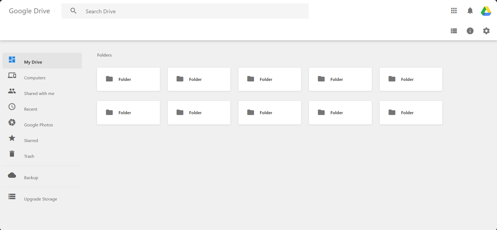

# Google-Drive-Clone

This is a Google Drive clone website that has been created using HTML and CSS. It is a simple web application that replicates some of the basic functionalities of Google Drive, allowing users to upload, view, and manage files and folders.

## Features

- User-friendly interface: The website has been designed with a clean and intuitive interface, making it easy for users to navigate and use the functionalities.
- File and folder management: Users can upload files, create folders, and manage them by renaming, deleting, or moving them to different folders.
- File preview: Users can preview the uploaded files, such as images and documents, within the website itself.
- Responsive design: The website is responsive, meaning it can adapt to different screen sizes and devices, making it accessible on desktop computers, tablets, and mobile devices.
- Customizable: The website's appearance and layout can be easily customized using CSS to suit individual preferences and branding requirements.

## Technologies Used

- HTML: Used for creating the structure and content of the web pages.
- CSS: Used for styling the website and making it visually appealing.

## How to Use

1. Clone the repository to your local machine or web server.
2. Open the `index.html` file in a web browser.
3. Use the website to upload, manage, and preview files and folders as desired.

## Screenshots

## Feedback

If you have any feedback, please reach out to me at ankurkarmakardonno.1@gmail.com.
